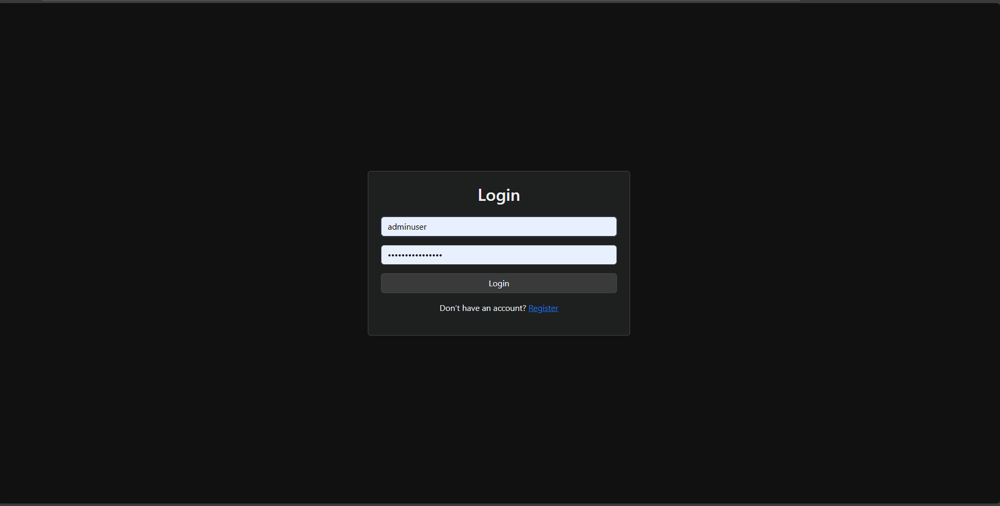
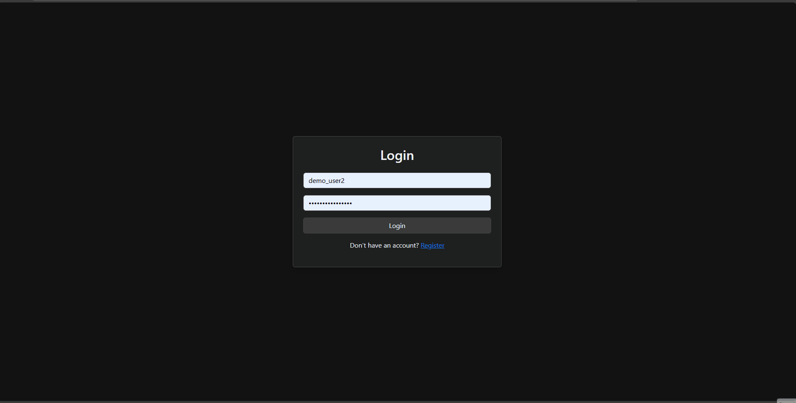
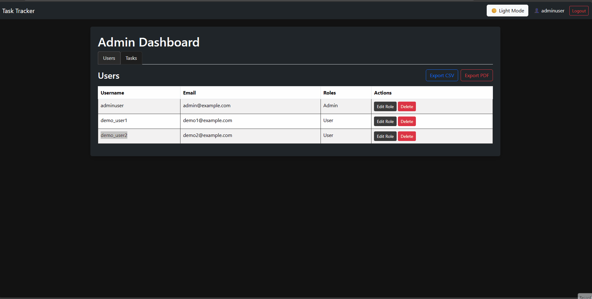
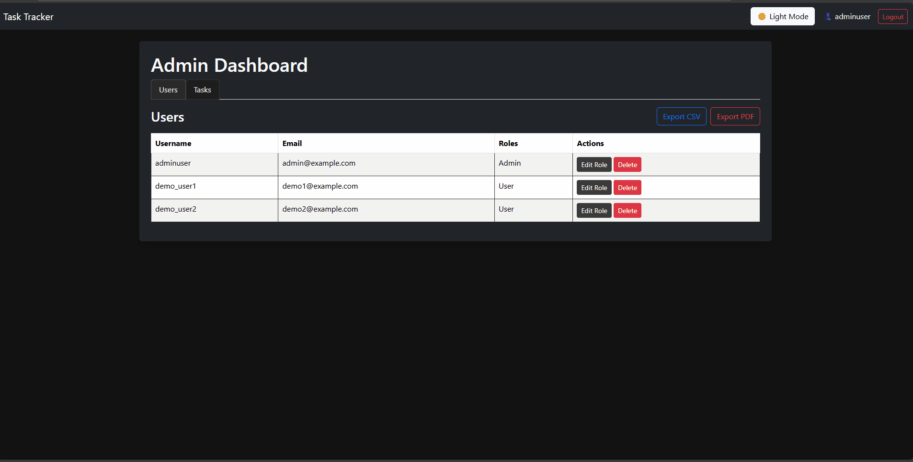
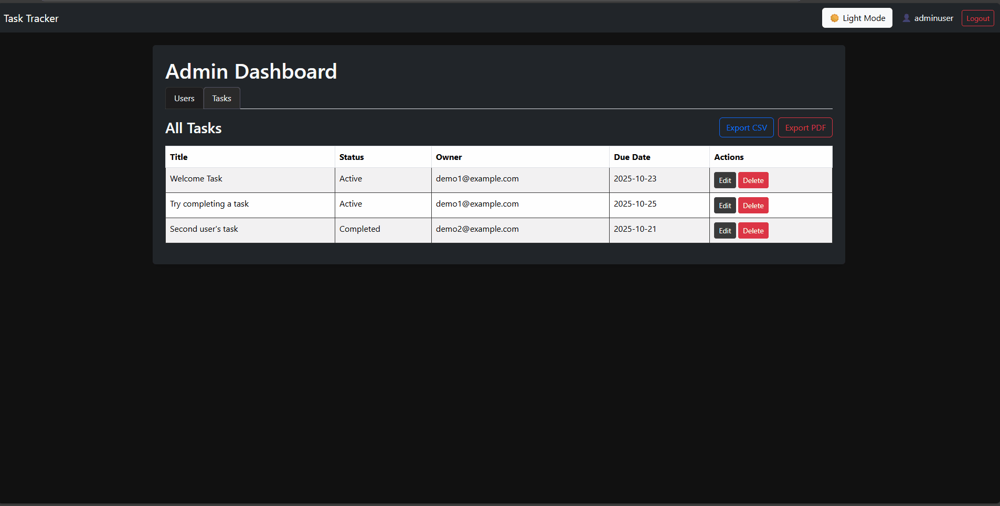
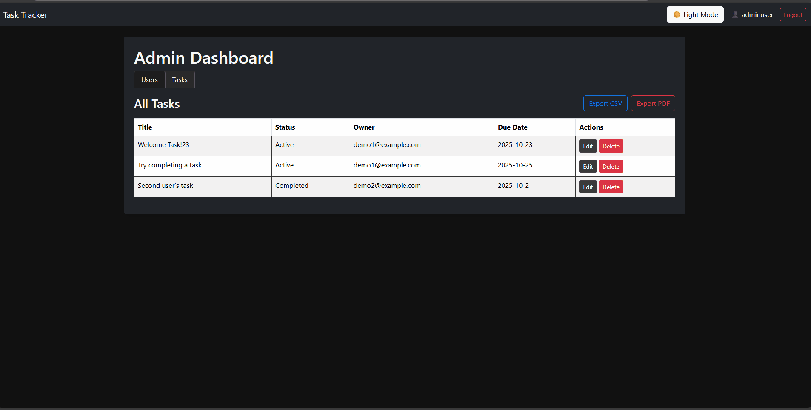
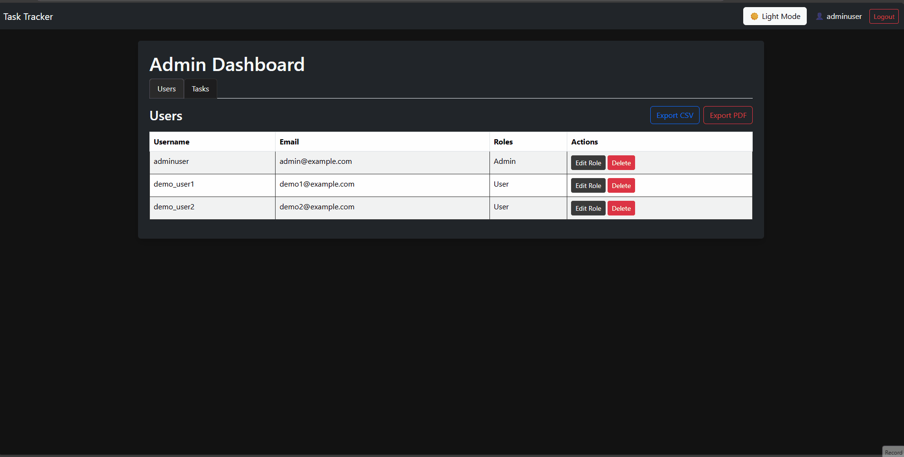
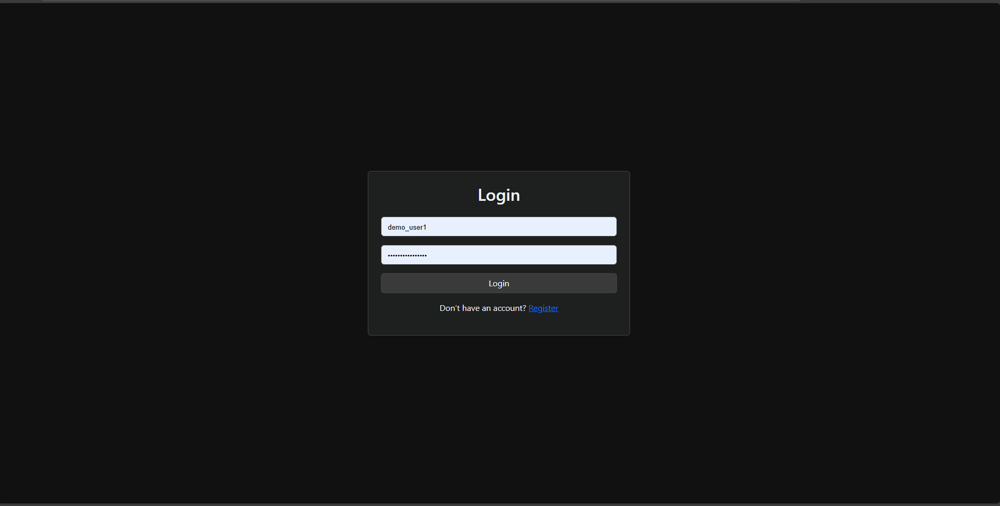

# TaskTracker – Backend API

This is the backend API for **TaskTracker**, a full-stack task management system built with ASP.NET Core and React.
It provides secure JWT authentication with refresh tokens, role-based access control, seeded demo data, and data export (PDF and CSV).
Designed for lightweight deployment using an in-memory database, ideal for demos or CI environments.

---

## Live Deployment

**Backend API:** [https://tasktracker-api-5qyf.onrender.com](https://tasktracker-api-5qyf.onrender.com)
**Frontend:** [https://a51398-tasktracker-client.netlify.app](https://a51398-tasktracker-client.netlify.app)

---

### Admin Dashboard

#### Users Tab
**View Users**


**Edit Role**
_Before editing the role_


_After editing the role_


**Delete Users**


#### Tasks Tab
**View Tasks**


**Update Task**


**Delete User Tasks**


#### Export
**Both tabs support CSV and PDF exports**


### User Dashboard


Includes full task management capabilities:
- Create, update, delete tasks  
- Filter and sort tasks  
- Export tasks to CSV or PDF

---

## Features
- Role-based authentication (Admin/User)
- Dark/Light theme toggle with persistence
- Task management (Create, Update, Delete)
- PDF and CSV export
- Token refresh and session handling
- Responsive UI for all device sizes

---

## Tech Stack

* ASP.NET Core 9 Web API
* Entity Framework Core (InMemory)
* JWT + Refresh Token Authentication
* QuestPDF (PDF export)
* CSV export via `StringBuilder`
* xUnit for unit testing
* Hosted on Render (Docker deployment)

---

## Folder Structure

* **Controllers/** – API endpoints
* **Services/** – Core business logic (Auth, Tasks, Admin, Export)
* **Repositories/** – Data access layer (optional, for extensibility)
* **DTO/** – Data transfer objects for API communication
* **Models/** – Entity definitions (User, Task, Tokens)
* **Data/** – EF Core DbContext and seeding configuration
* **Tests/** – xUnit test projects for services and controllers

---

## Authentication Overview

* JWT access token issued upon successful login
* Access token stored client-side in `localStorage`
* Refresh token stored securely in an **HttpOnly cookie**
* Automatic token refresh handled on the frontend via Axios interceptors

---

## Database & Seeding

* Uses **EF Core InMemory** database for development and demos
* Automatically seeds demo data on startup:

  * One admin user
  * Multiple demo users
  * Sample tasks

To persist data, update `Program.cs` to use SQL Server:

```csharp
builder.Services.AddDbContext<TaskDbContext>(options =>
    options.UseSqlServer(builder.Configuration.GetConnectionString("DefaultConnection")));
```

Then, add your connection string in `appsettings.json`.

---

## Configuration Example (`appsettings.json`)

```json
"Jwt": {
  "Key": "s3cr3tK3yJwtSecur3t0kenPassw0rd!!",
  "Issuer": "TaskTrackerApi",
  "Audience": "TaskTrackerClient"
},
"AdminCredentials": {
  "Email": "adminuser@example.com",
  "UserName": "adminuser",
  "Password": "YourPassword123!"
}
```

---

## Testing

* **Framework:** xUnit
* **Coverage:**

  * Services (AuthService, TaskService, AdminService)
  * Controllers (AccountController, TasksController)
* Uses an **in-memory database** for isolated testing

Run tests:

```bash
dotnet test
```

---

## Deployment

* **Hosting:** Render (Docker)
* **Builds from:** GitHub repository
* **Environment variables:** Configured via Render Dashboard
* **CI/CD:** Automatic redeploys on push to `main` branch

---

## Future Plans

* Add persistent SQL Server or PostgreSQL database
* Implement dashboard statistics (task and user summaries)
* Extend test coverage for export and role management
* Improve admin tools and analytics

---